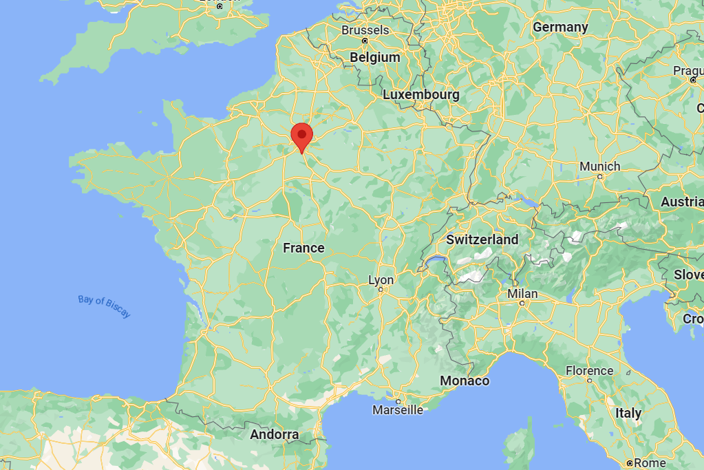

<h1 align="center">

Hello there :wave:, I'm <strong>Nathan SOARES DE MELO
  
🔵⚪🔴    I'm a 20 years old french generalist engineering student at   <strong>Télécom SudParis</strong>    🔵⚪🔴</strong></h1>

## :mortar_board: **Where do I study ?**

I'm currently studying at Télécom SudParis, a graduate engineering school in Evry-Courcouronnes, France. I'm in my 3rd year of a 5 years long program, called "Cycle Ingénieur". I'm currently in the generalist department.

  

    
    
Télécom SudParis, Graduate Engineering School since 1979

  

---

## :computer: My computing skills

  

    <h3>Programming languages :</h3>
    

        
    

  

  

    <h3>And other :</h3>
    

      
    

  

  

  <h3>Platforms i use :</h3>
    

        
    

  

---

## :bulb: **What are my main projects ?**

### **Python projects**

* [PRO3600](https://github.com/nathsdm/PRO3600) : Mobile app and Desktop software that allows you to create, manage and update your Yu-gi-oh collection.
* [Populations-interactions](https://github.com/nathsdm/Populations-interactions) : Application that models two populations interactions, considering homophily and pouplations proportions.

### **Other perspectives**

* Learning JavaScript, C++, php, and more...
* Going deeper in the world of web development
* Learning more about databases and collecting data
* Learning more about machine learning and artificial intelligence

---

## :information_source: GitHub Stats

  

<h2 align="center">
</h2>
